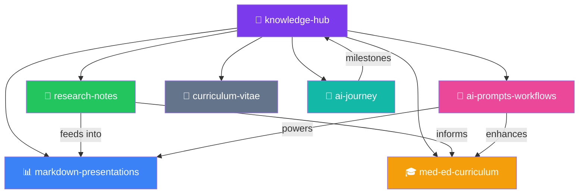

# 🧠 Knowledge Hub — Dr. MTD Lakshan

> Central index for my versioned knowledge system.  
> Medical Education × Artificial Intelligence

## Knowledge Map

## Active Repositories

| Repo | Domain | Visibility | Status |
|------|--------|------------|--------|
| [knowledge-hub](https://github.com/drlakshan/knowledge-hub) | Central index | Public | 🟢 Active |
| [markdown-presentations](https://github.com/drlakshan/markdown-presentations) | Marp talks | Public | 🟢 Active |
| [research-notes](https://github.com/drlakshan/research-notes) | Research & literature | Private | 🟢 Active |
| [med-ed-curriculum](https://github.com/drlakshan/med-ed-curriculum) | Course design | Private | 🟢 Active |
| [ai-prompts-workflows](https://github.com/drlakshan/ai-prompts-workflows) | AI prompt library | Public | 🟢 Active |
| [curriculum-vitae](https://github.com/drlakshan/curriculum-vitae) | CV (branched) | Private | 🟢 Active |
| [ai-journey](https://github.com/drlakshan/ai-journey) | AI milestones | Private | 🟢 Active |

## Archived Repositories

`langchain` · `youtube-fabric-gui` · `twitter-meded-ai` · `nuxt-app` · `haem` · `entcollege` · `healthlk` · `dummy` · `portfolio_4--drive`

## Intellectual Changelog

See [CHANGELOG.md](CHANGELOG.md) for major milestones across all repos.

## Portability

This entire system is designed for zero vendor lock-in:
- All content is plain Markdown + YAML
- Automation logic lives in `scripts/` (not CI-specific configs)
- CITATION.cff provides platform-independent citation metadata
- See any repo's `ci-templates/` for multi-platform CI configs

## Citation

If you use any of this work, please cite using the CITATION.cff file in the relevant repository, or reference this hub.

---

*Built with Git. Portable by design. No vendor lock-in.*
