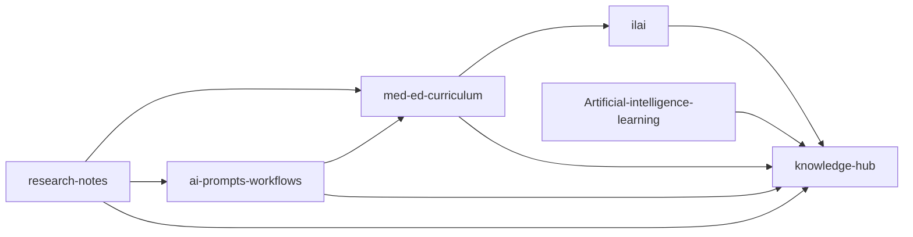

# 🧠 Knowledge Hub — Master Repository Map

> Single source of navigation for Dr. Lakshan’s GitHub knowledge system.

## System Intent
Reduce confusion by maintaining a small **canonical active set** and archiving legacy/experimental repositories.

---

## Canonical Active Repositories

| Repository | Primary role | Typical outputs | Status |
|---|---|---|---|
| [knowledge-hub](https://github.com/drlakshan/knowledge-hub) | System index, governance, changelog | Repo map, archive policy, standards | 🟢 Active |
| [research-notes](https://github.com/drlakshan/research-notes) | Research capture and synthesis | Literature notes, reviews, paper drafts | 🟢 Active |
| [med-ed-curriculum](https://github.com/drlakshan/med-ed-curriculum) | Curriculum design and frameworks | Course blueprints, teaching frameworks | 🟢 Active |
| [ai-prompts-workflows](https://github.com/drlakshan/ai-prompts-workflows) | Prompt/system workflow library | Prompt templates, evals, automation scripts | 🟢 Active |
| [ilai](https://github.com/drlakshan/ilai) | Public-facing web presence (ILAI) | Website pages/assets | 🟢 Active |
| [Artificial-intelligence-learning](https://github.com/drlakshan/Artificial-intelligence-learning) | Academic AI portfolio/archive | CV material, presentations, milestone docs | 🟢 Active |

---

## Functional Flow (How repos connect)

Interpretation:
- `research-notes` is evidence intake.
- `med-ed-curriculum` is educational packaging.
- `ai-prompts-workflows` is AI method/automation layer.
- `ilai` is public communication.
- `knowledge-hub` is governance + map.

---

## Archive Governance

When a repo is no longer active:
1. Mark readme as archived + successor link.
2. Tag final state (`archive-final-YYYY-MM`).
3. Archive in GitHub settings.
4. Record in this hub.

Use: [ARCHIVE-CHECKLIST.md](ARCHIVE-CHECKLIST.md)

---

## Archived / Legacy Repositories

`langchain` · `youtube-fabric-gui` · `twitter-meded-ai` · `nuxt-app` · `haem` · `entcollege` · `healthlk` · `dummy` · `portfolio_4--drive`

> Note: keep archives searchable, but avoid active development there.

---

## Conventions

- Markdown-first, Git-first, portable-by-design
- Prefer reusable scripts over platform-locked automation
- Keep one clear canonical repo per function

---

## Related

- [CHANGELOG.md](CHANGELOG.md)
- [KNOWLEDGE-MAP.mermaid](KNOWLEDGE-MAP.mermaid)
- [CITATION.cff](CITATION.cff)
