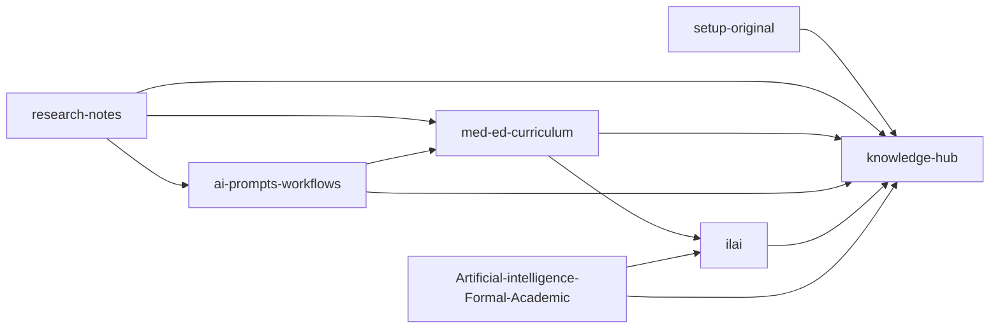

# 🧠 Knowledge Hub — Master Repository Map

> Single source of navigation for Dr. Lakshan’s GitHub knowledge system.

## System Intent
Maintain a **clean, low-confusion GitHub architecture** that mirrors local structure:
- small canonical active set
- everything else archived

---

## Canonical Active Repositories (mirrors local `/GitHub`)

| Repository | Primary role | Status |
|---|---|---|
| [Artificial-intelligence-Formal-Academic](https://github.com/drlakshan/Artificial-intelligence-Formal-Academic) | Academic AI portfolio and formal outputs | 🟢 Active |
| [ai-prompts-workflows](https://github.com/drlakshan/ai-prompts-workflows) | Prompt/system workflow library | 🟢 Active |
| [ilai](https://github.com/drlakshan/ilai) | ILAI public web presence | 🟢 Active |
| [knowledge-hub](https://github.com/drlakshan/knowledge-hub) | Central map + governance | 🟢 Active |
| [med-ed-curriculum](https://github.com/drlakshan/med-ed-curriculum) | Curriculum frameworks and courses | 🟢 Active |
| [research-notes](https://github.com/drlakshan/research-notes) | Research capture and synthesis | 🟢 Active |
| [setup-original](https://github.com/drlakshan/setup-original) | Setup/bootstrap scripts and implementation guide | 🟢 Active |

---

## Functional Flow

---

## Archive Governance

When a repo becomes non-canonical:
1. Mark README as archived + successor link.
2. Tag final state (`archive-final-YYYY-MM`).
3. Archive in GitHub settings.
4. Record in this hub.

Use: [ARCHIVE-CHECKLIST.md](ARCHIVE-CHECKLIST.md)

---

## Archived / Legacy Repositories

`Curriculam-Vitae` · `Obsidian-AWS` · `case-report-writer` · `crewAILearning` · `dummy` · `education` · `entcollege` · `fabric-app` · `github-journal-project` · `haem` · `healthlk` · `ilai-main-organisation` · `infinite-leaner-ai-buisiness-planner` · `infinte_learner` · `langchain` · `markdown-presentations` · `nuxt-app` · `pdfchatbot` · `portfolio_4--drive` · `process-analyser` · `skills-getting-started-with-github-copilot` · `smart-prescription-pad` · `thinking-space` · `twitter-meded-ai` · `youtube-agent` · `youtube-fabric-gui`

---

## Related

- [CHANGELOG.md](CHANGELOG.md)
- [KNOWLEDGE-MAP.mermaid](KNOWLEDGE-MAP.mermaid)
- [CITATION.cff](CITATION.cff)
